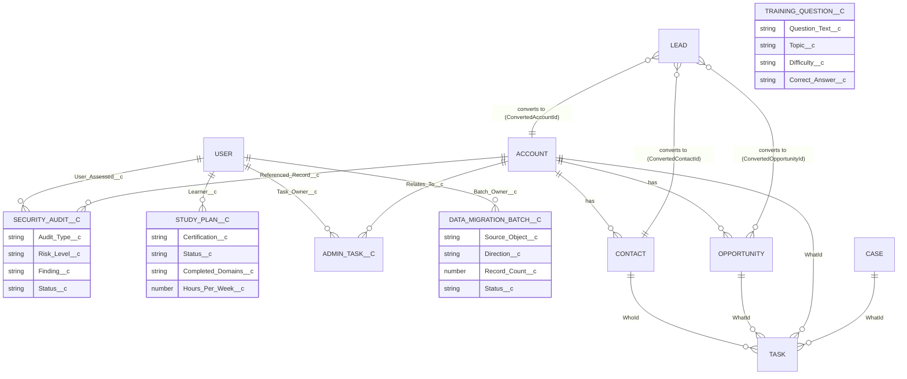
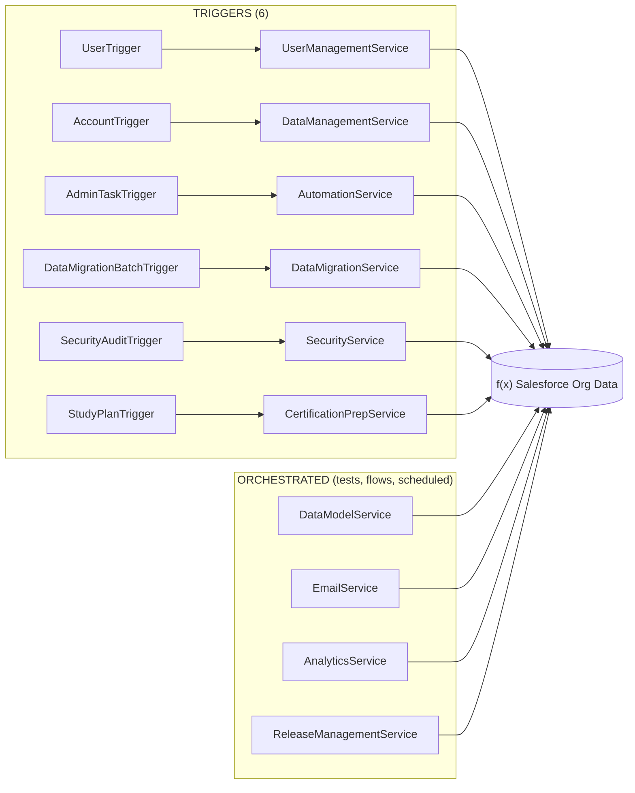
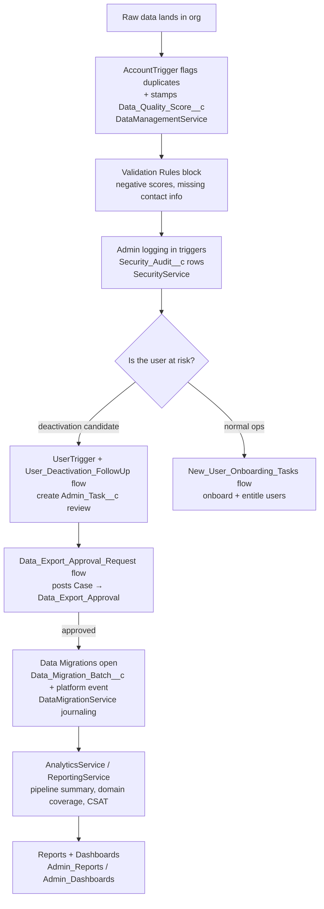
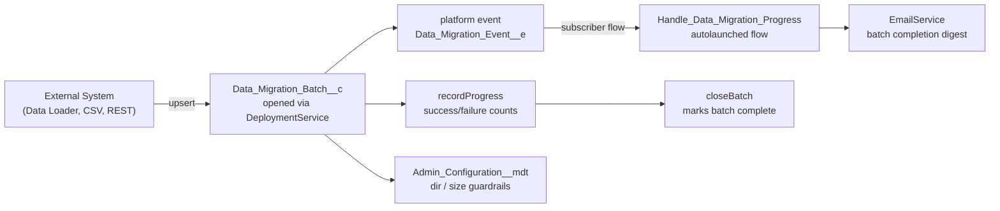
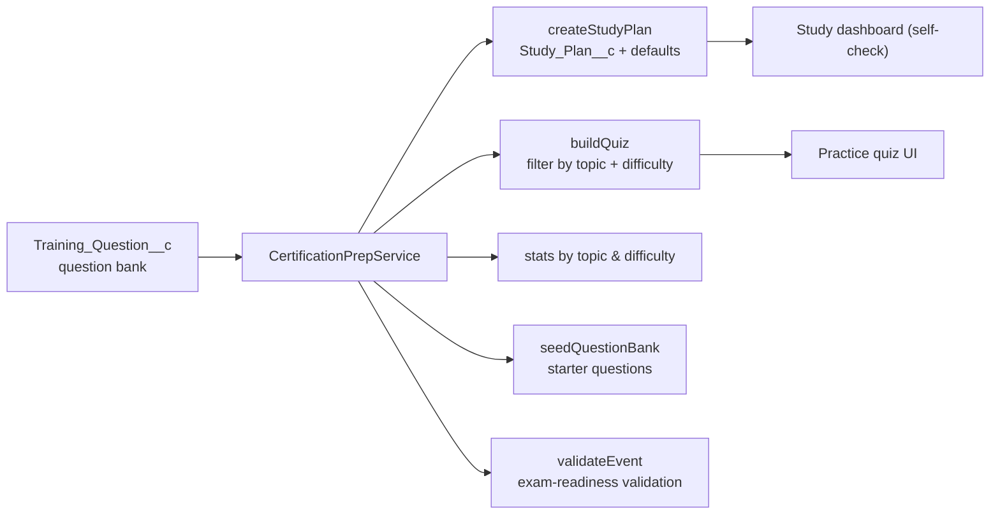

# 🏗️ Salesforce Administration RoadMap — Architecture

This document is a visual walkthrough of the system built across the 12 phases. All diagrams are [Mermaid](https://mermaid.js.org) and render natively on GitHub.

---

## 1. High-Level Architecture (Layered)

The project follows a **layered architecture**: Lightning Experience on top, automation in the middle, an Apex service layer doing the business logic, and clean, normalized data underneath.

```mermaid
flowchart TB
    subgraph UI["PRESENTATION"]
        UX["Lightning Experience — Admin App"]
        DSB["Reports (7) & Dashboards (4)"]
        QUIZ["Certification Prep — Question Bank UI"]
    end

    subgraph AUTOMATION["AUTOMATION LAYER"]
        F[Flows (8)<br/>onboarding, deactivation follow-up, export approval,<br/>sensitive-data review, import validation, escals]
        VR[Validation Rules (6)<br/>data-quality guards, closed-deal locks, future-due guards]
        AR[Assignment Rules<br/>priority → queue routing]
        AP[Approval Process<br/>Case data-export approval]
    end

    subgraph APEX["APEX LAYER (business logic)"]
        TRIGGERS["6 Triggers<br/>User, Account, Admin_Task, Data_Migration_Batch,<br/>Security_Audit, Study_Plan"]
        SERVICES["10 Service Classes<br/>DataModel, Security, UserManagement, DataManagement,<br/>Automation, Email, Analytics, ReleaseManagement,<br/>DataMigration, CertificationPrep"]
        PE["Data_Migration_Event__e<br/>Platform Event"]
        CMT["Admin_Configuration__mdt<br/>Custom Metadata"]
    end

    subgraph DATA["DATA LAYER"]
        STD["Standard Objects<br/>User, Account, Contact, Lead, Opportunity,<br/>Case, Task (+62 custom fields)"]
        CUSTOM["Custom Objects<br/>Security_Audit__c, Data_Migration_Batch__c,<br/>Training_Question__c, Study_Plan__c, Admin_Task__c"]
    end

    UX --> F
    UX --> VR
    UX --> AR
    UX --> AP

    F --> SERVICES
    VR --> DATA
    AR --> DATA
    AP --> SERVICES

    UX --> TRIGGERS
    TRIGGERS --> SERVICES
    SERVICES --> DATA

    SERVICES --> PE
    PE --> CMT

    DSB --> SERVICES
    QUIZ --> SERVICES
    QUIZ --> CUSTOM

    DATA --> DSB
    DATA --> QUIZ
```

> **Architecture principles used throughout:**
> - **Trigger-light / Service-heavy**: triggers only detect events; all logic lives in testable service classes.
> - **Bulk-safe**: every trigger iterates `Trigger.new` lists, never `for` loops with per-record DML.
> - **`with sharing`**: services enforce the security model.
> - **Test-isolated**: every service has a `@isTest` companion using `@TestSetup`.

---

## 2. Data Model

Salesforce standard objects + the 5 custom objects and their relationships. Custom fields extend each standard object (e.g. `Data_Quality_Score__c` on Account, `Onboarding_Status__c` on User).



**Custom objects & their purpose:**

| Custom Object | Purpose | Used By |
|---------------|---------|---------|
| `Security_Audit__c` | Login/automation audit trail with risk findings | `SecurityService` |
| `Data_Migration_Batch__c` | Migration lifecycle + progress journaling | `DataMigrationService` |
| `Training_Question__c` | Mini certification question bank | `CertificationPrepService` |
| `Study_Plan__c` | Personalized exam-prep study plans | `CertificationPrepService`, `StudyPlanTrigger` |
| `Admin_Task__c` | Cross-object admin chores (onboarding, escalation, review) | `AutomationService`, flows |
| `Data_Migration_Event__e` (platform event) | Async batch-progress notifications | `DataMigrationService` |
| `Admin_Configuration__mdt` (custom metadata) | Read-only org guardrail configuration | flows + services |

---

## 3. Trigger → Service Wiring

Every trigger delegates to exactly one service (or applies an inline default) — no business logic lives inside a trigger.



> **Note:** `DataModelService`, `EmailService`, `AnalyticsService` and `ReleaseManagementService` are orchestrated services — invoked from Flows, scheduled automation, or Apex tests rather than object triggers.

---

## 4. End-to-End Admin Workflow (data → quality → security → migrate)

How a messy, under-governed org becomes a clean, secure, migration-ready org — with each step instrumented as metadata.



---

## 5. Data-Migration Architecture (Phase 5)



---

## 6. Certification Prep Architecture (Phase 12)



---

## 7. Folder → Architectural Layer Mapping

| Roadmap folder | Layer |
|----------------|-------|
| `force-app/main/default/classes/` | Apex service + test classes |
| `force-app/main/default/triggers/` | Event detection (thin) |
| `force-app/main/default/flows/` | Declarative automation |
| `force-app/main/default/objects/` | Data model (fields, validation rules) |
| `force-app/main/default/customMetadata/` | Org guardrail configuration |
| `force-app/main/default/platformEvents/` | Event-driven substrate |
| `force-app/main/default/approvalProcesses/` | Human-in-the-loop approvals |
| `force-app/main/default/assignmentRules/` | Routing (queues) |
| `force-app/main/default/reports/` + `dashboards/` | Analytics |
| `force-app/main/default/permissionsets/` | Security / FLS |
| `admin Roadmap/` | Curriculum (12 phase guides) |
| `scripts/soql/` + `scripts/apex/` | Practice queries + playgrounds |